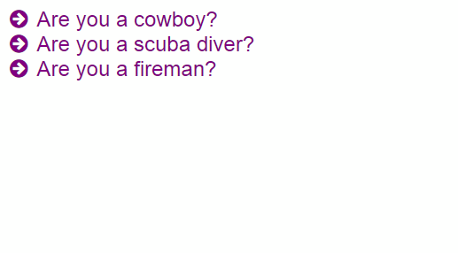

# Decision Tree Maker
pass an array of strings and get a clickable decision tree



First, create your element to which Decision Tree Maker will be added:

```
<div id="tree"></div>
```

Include the script after jQuery and optionally Font Awesome:

```
<link rel="stylesheet" type="text/css" href="//maxcdn.bootstrapcdn.com/font-awesome/4.3.0/css/font-awesome.min.css">
<script src="decisionTreeMaker.js"></script>
```

Create your array in a JS file:

```
var a = [
'=Are you a cowboy?',
'==Do you have guns?',
'*That is awesome.',
'==Are you unarmed?',
'*That\'s pretty cool.',
'=Are you a scuba diver?',
'==Have you seen a sting ray?',
'*That\'s scary.',
'==Have seen an octopus?',
'*Wow, incredible.',
'=Are you a fireman?',
'==Have you put out > 5 fires?',
'*That\'s pretty cool.',
'==Have you put out > 10 fires??',
'*That fantastic!',
];
```

Run it!
Argument 1: Array of strings
Argument 2: Id of HTML element

```
tree(a, 'tree');
```

You can use this CSS too

```
.decision-tree-maker {
    font-size: 24px;
    font-family: sans-serif;
}
.decision-tree-maker a {
    color: purple;
    text-decoration: none;
}
.decision-tree-maker a:hover {
    color: black;
}
.decision-tree-maker ul {
    display: none;
}
.decision-tree-maker li {
    list-style-type: none;
}
.decision-tree-maker i {
    margin-right: 10px;
}
```
